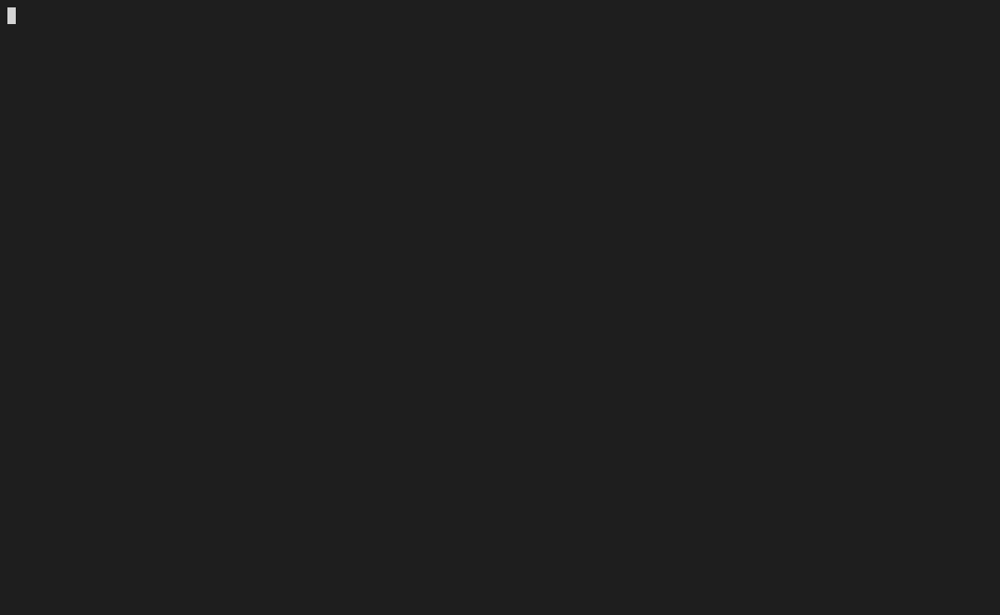

## Playball!
Watch MLB games from the comfort of your own terminal



### Why?
[MLB Gameday](http://www.mlb.com/mlb/gameday/#) and [MLB.tv](http://mlb.tv) are
great, but sometimes you want to keep an eye on a game a bit more discreetly.
`playball` puts the game in a terminal window.

### Quick Start
Just want to try it out?
```
$ npx playball
```

### Install
Ready for the big leagues? Install the package globally
```
$ npm install -g playball
```
Then run it
```
$ playball
```

### Docker
```
$ docker build -t playball .
$ docker run -it --rm --name playball playball:latest
```

#### Build options

Update the language encoding of by adding `--build-args`

```
$ docker build --build-arg LANG=en_US.UTF-8 -t playball .
```

### Keys
#### Global
key | action
----|--------
<kbd>q</kbd> | quit
<kbd>c</kbd> | go to schedule view
<kbd>s</kbd> | go to standings view

#### Schedule View
key | action
----|--------
<kbd>&darr;</kbd>/<kbd>j</kbd>, <kbd>&uarr;</kbd>/<kbd>k</kbd>, <kbd>&larr;</kbd>/<kbd>h</kbd>, <kbd>&rarr;</kbd>/<kbd>l</kbd> | change highlighted game
<kbd>enter</kbd> | view highlighted game
<kbd>p</kbd> | show previous day's schedule/results
<kbd>n</kbd> | show next day's schedule
<kbd>t</kbd> | return to today's schedule

#### Game View
key | action
----|--------
<kbd>&darr;</kbd>/<kbd>j</kbd>, <kbd>&uarr;</kbd>/<kbd>k</kbd> | scroll list of all plays

### Configuration

Playball can be configured using the `config` subcommand. To list the current configuration values run the subcommand with no additional arguments:

```shell
playball config
```

You should see output similar to:

```
color.ball = green
color.favorite-star = yellow
color.in-play-no-out = blue
color.in-play-out = white
color.in-play-runs-bg = white
color.in-play-runs-fg = black
color.on-base = yellow
color.other-event = white
color.out = red
color.strike = red
color.strike-out = red
color.walk = green
favorites = 
```

To get the value of a single setting pass the key as an additional argument:

```shell
playball config color.strike
```

To change a setting pass the key and value as arguments:

```shell
playball config color.strike blue
```

To revert a setting to its default value provide the key and the `--unset` flag:

```shell
playball config color.strike --unset
```

This table summarizes the available settings:

key | description | default | allowed values
----|-------------|---------|---------------
`color.ball` | Color of dots representing balls in top row of game view | green | One of the following: `black`, `red`, `green`, `yellow`, `blue`, `magenta`, `cyan`, `white`, `grey`. Any of those colors may be prefixed by `bright-` or `light-` (for example `bright-green`). The exact color used will depend on your terminal settings. The value `default` may be used to specify the default text color for your terminal. Finally hex colors (e.g `#FFA500`) can be specified. If your terminal does not support true color, the closest supported color may be used. 
`color.favorite-star` | Color of star indiciating favorite team in schedule and standing views | yellow | _See above_
`color.in-play-no-out` | Color of result where ball was put in play and no out was made (single, double, etc) in list of plays in game view | blue | _See above_
`color.in-play-out` | Color of result where ball was put in play and an out was made (flyout, fielder's choice, etc) in list of plays in game view | white | _See above_
`color.in-play-runs-bg` | Background color for score update in list of plays in game view | white | _See above_
`color.in-play-runs-fg` | Foreground color for score update in list of plays in game view | black | _See above_
`color.on-base` | Color of diamonds representing runners on base in top row of game view | yellow | _See above_
`color.other-event` | Color of other events (mound visit, injury delay, etc) in list of plays in game view | white | _See above_
`color.out` | Color of dots representing outs in top row of game view | red | _See above_
`color.strike` | Color of dots representing strikes in top row of game view | red | _See above_
`color.strike-out` | Color of result where play ends on a strike (strike out) in list of plays in game view | red | _See above_
`color.walk` | Color of result where play ends on a ball (walk, hit by pitch) in list of plays in game view | green | _See above_
`favorites` | Teams to highlight in schedule and standings views | | Any one of the following: `ATL`, `AZ`, `BAL`, `BOS`, `CHC`, `CIN`, `CLE`, `COL`, `CWS`, `DET`, `HOU`, `KC`, `LAA`, `LAD`, `MIA`, `MIL`, `MIN`, `NYM`, `NYY`, `OAK`, `PHI`, `PIT`, `SD`, `SEA`, `SF`, `STL`, `TB`, `TEX`, `TOR`, `WSH`. Or a comma-separated list of multiple (e.g. `SEA,MIL`)

### Development
```
git clone https://github.com/paaatrick/playball.git
cd playball
npm install
npm start
```
Contributions are welcome!
